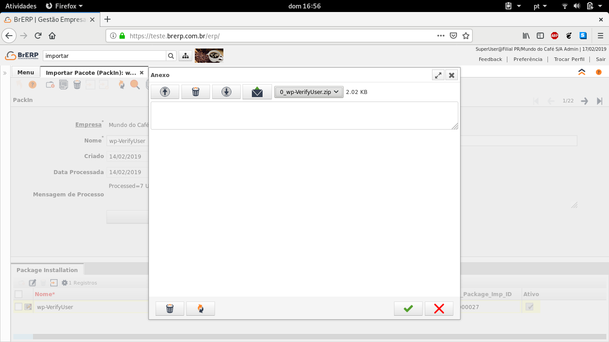
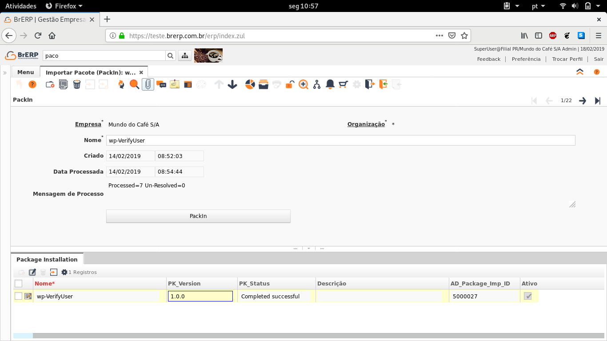
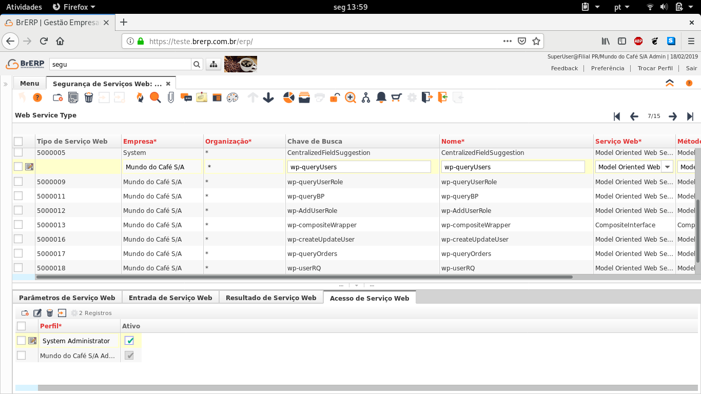
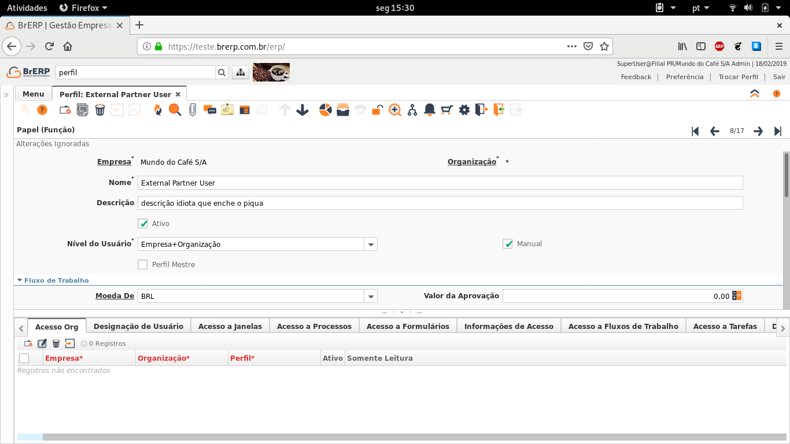
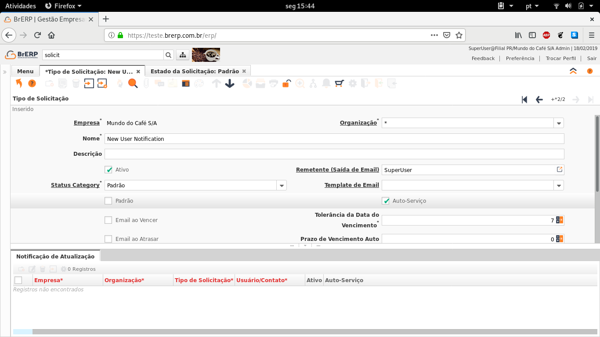
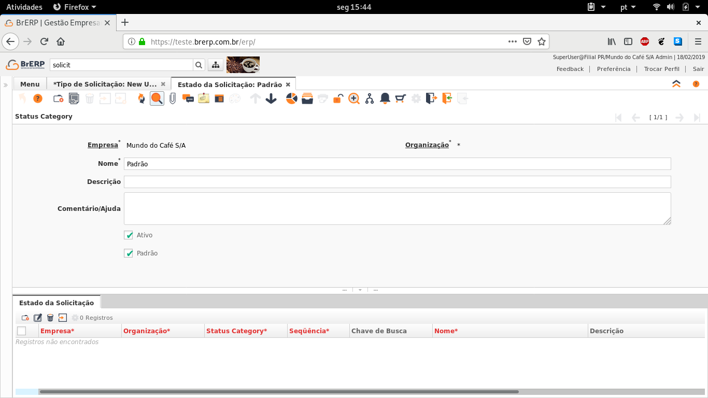
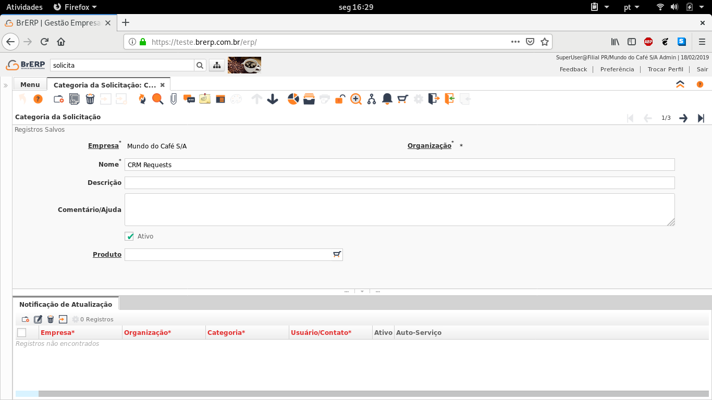
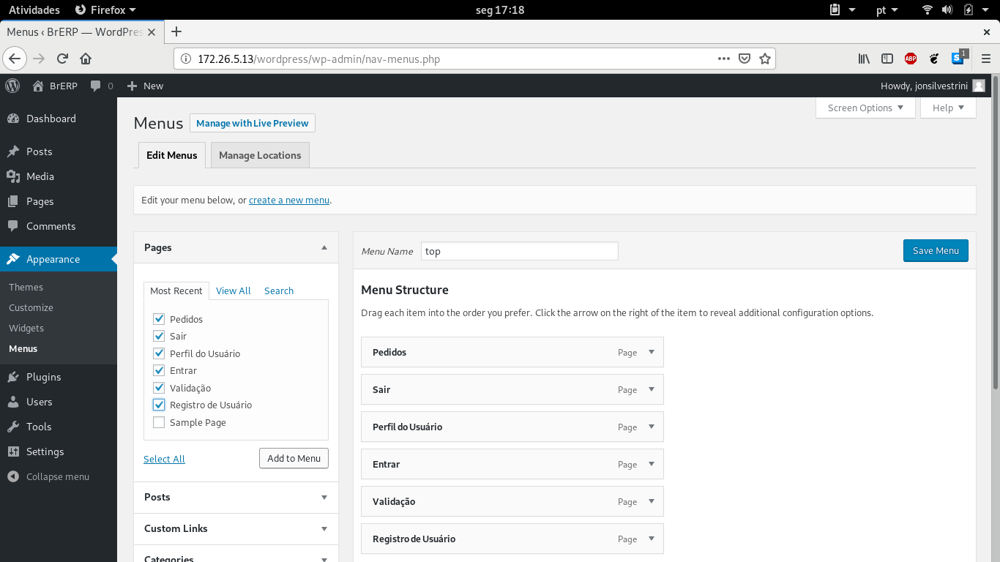

# Plugins de exemplo de conexão do BrERP com o WordPress
---

Esse repositório tem como objetivo mostrar a exemplos de conexão do BrERP com o WordPress. A partir desses exemplos é possível criar a personalizações de páginas no WordPress. A comunicação é feita com o protocolo SOAP e utiliza o Web Service disponibilizado pelo próprio BrERP. Essa documentação mostra como configurar o BrERP e como instalar os plugins de exemplo no WordPress

## Preparando o Web Service no BrERP

### Importando as configurações de Web Service no BrERP

O primeiro passo é importar as configurações de Web Service para o BrERP. As configurações podem ser importadas pela janela **Importar Pacote (PackIn)** e os arquivos para importação estão no **Pacotes.zip**, que se encontra neste repositório. Ao descompactar ele, terá 9 arquivos. É necessário importar um a um no BrERP

Na janela **Importar Pacote (PackIn)**, clique em *Novo Registro*. Nomeie o como "Web Service Import" e salve. Após clique em *anexo* e importe os plugins um a um. Ou, se preferir, também é possível criar um novo registro e para cada pacote e nomear os registros com o mesmo nome dos pacotes. Assim fica mais claro o que já foi importado



Após é necessário clicar em PackIn. O pacote deverá ser importado e uma mensagem de status da importação deverá mostrado na aba *Package Installation*



### Criando as permissões de acesso de usuário

Depois é preciso liberar o acesso ao Web Service. Para isso, abra a janela **Segurança de Serviços Web**, selecione o pacote e na aba *Acesso de Serviço Web* e crie um novo registro e associe o usuário que terá acesso ao Web Service



### Criando perfil de acesso externo

É necessário criar o perfil de acesso externo. Abra a janela **Perfil** e crie o um perfil chamado *External Partner User*. Mude o nível de acesso para *Empresa+Organização*



### Criando um novo Tipo de Solicitação

Na janela **Tipo de Solicitação**, crie um novo tipo de solicitação chamado *New User Notification*. Caso não exista registro no campo *Status Category*, apenas clique em cima do nome do campo e crie uma nova Status Category chamado *Padrão*. Marque a opção *Ativa* e *Padrão*





### Criando a Categoria da Solicitação

Abra a janela **Categoria da Solicitação** e crie uma nova solicitação chamada *CRM Requests*



## Importando o Plugin no WordPress

Para instalar o plugin no WordPress, basta copiar a pasta *BrERP-plugin-examples* na pasta *wordpress/wp-content/plugins* 

Após é sóa ativar o plugin no painel do WordPress. Para localizar as páginas mais facilmente, adcione as páginas no *Top Menu* do WordPress. Para fazer isso vá na opção *Appearance* na barra lateral e selecione a opção *menus*. Depois é só selecionar as páginas do plugin e clicar em *Add to Menu* e depois em *Save Menu*



### general-settings.php

Esse arquivo contém as informações para fazer a conexão com o Web Service. Aqui pode ser definido a URL, usuário, senha, as IDs de Perfil, Categoria de Solicitação, Tipo de Solicitação, etc. Abaixo segue o arquivo de exemplo que pode ser encontrado nesse repositório:
```php
<?php  
$model_servic_url="http://teste.devcoffee.com.br/ADInterface/services/ModelADService?wsdl";
$composit_servic_url="http://teste.devcoffee.com.br/ADInterface/services/compositeInterface?wsdl";
$auth_user_name="superuser @ brerp.com.br";
$auth_user_pass="sua_senha";
$login_request='<_0:ADLoginRequest>
                <_0:user>'. $auth_user_name .'</_0:user>
			    <_0:pass>'. $auth_user_pass .'</_0:pass>
			    <_0:RoleID>1000000</_0:RoleID>
			    <_0:lang>128</_0:lang>
			    <_0:ClientID>1000000</_0:ClientID>
			    <_0:OrgID>5000003</_0:OrgID>
			    <_0:WarehouseID>5000007</_0:WarehouseID>
			    <_0:stage>0</_0:stage>
			    </_0:ADLoginRequest>';

$p_AD_Role_ID=1000000; // the AD_Role_ID of any new users registered
// Request related parameters, for the request created upon a new user registration
$p_R_RequestType_ID=5000000; 
$p_R_Category_ID=5000000;
$p_SalesRep_ID=101;
$c_BP_Group_ID=1000001;

//User Login Settings
$user_login_R_RequestType_ID=5000000;
$user_login_R_Category_ID=5000000;
$user_login_SalesRep_ID=1000000;
$user_login_C_BPartner_ID=1000004;
$user_login_AD_Table_ID=114;


//User Profile Settings
$user_profile_ad_user_id=1000000;
?>
```
